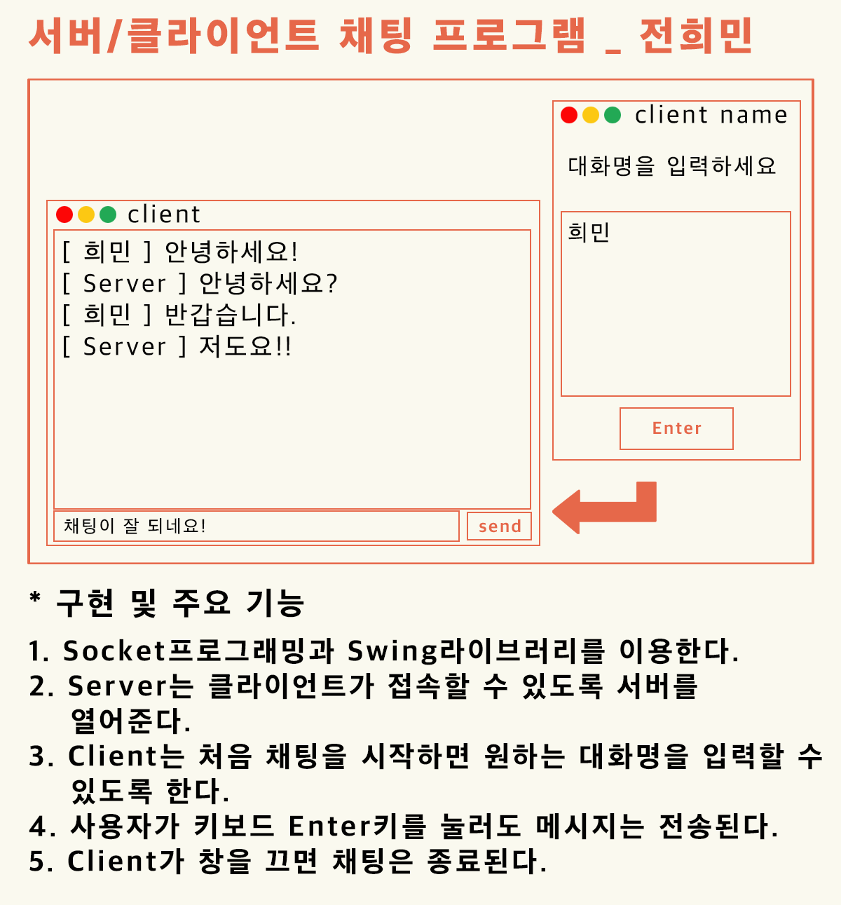
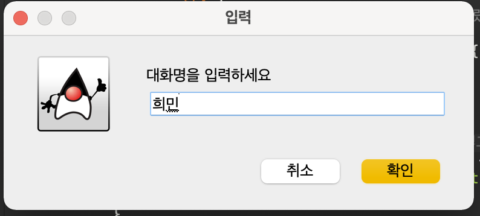
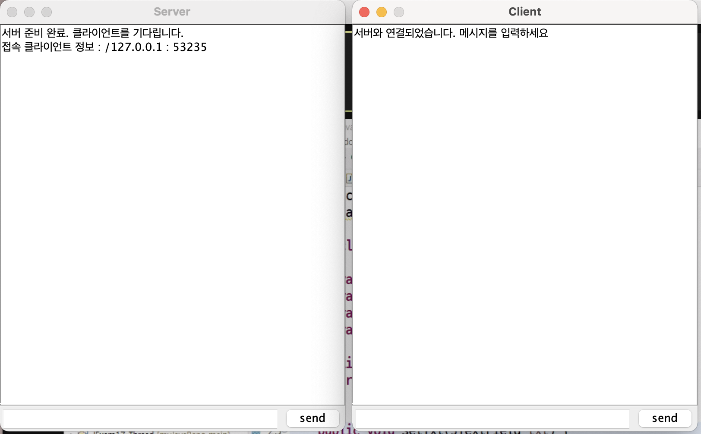
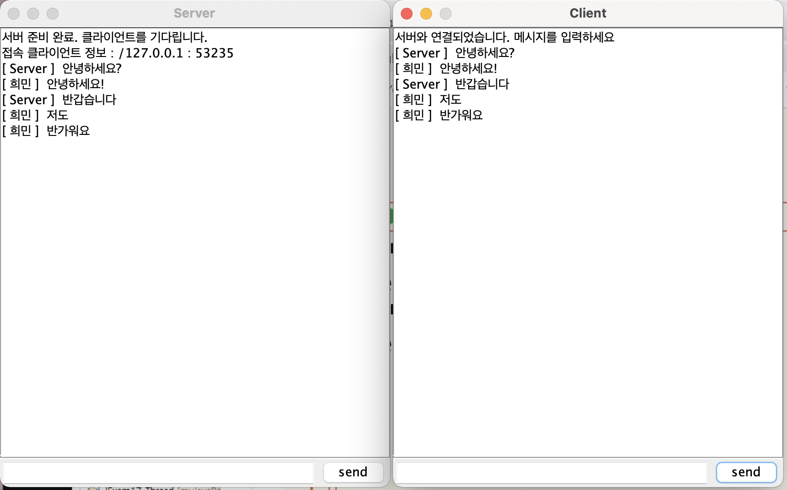
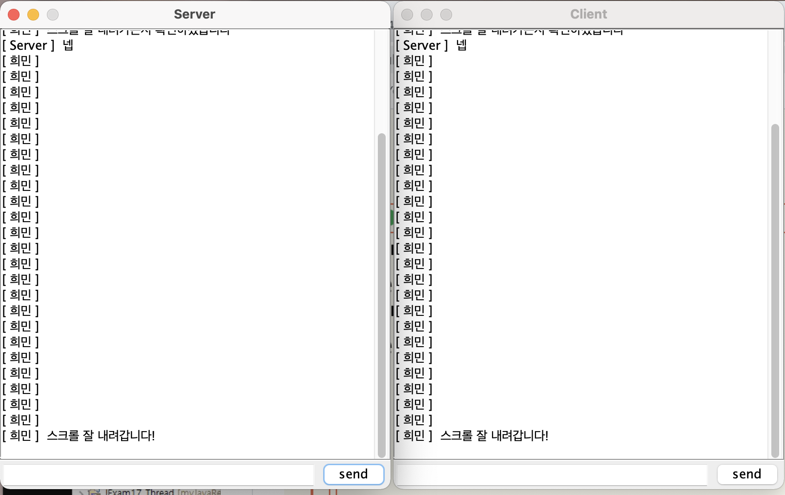
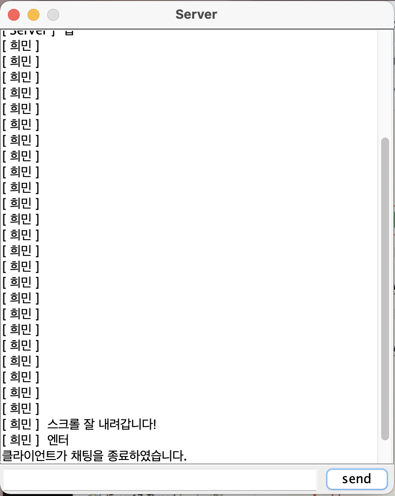
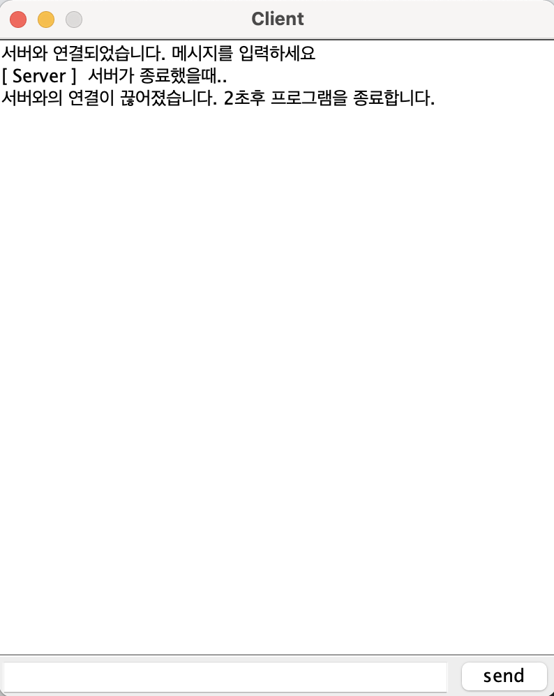

# 서버/클라이언트 채팅 프로그램

## 설계 & 목업 이미지

## 개선사항

2021.01.26 개선중
1. textField에 입력하고 Enter를 눌러도 server로 메시지가 전송되지 않는다. >> 해결. 오타였음..
	-> 지금 찾아보는 중인데, Enter키를 눌러서 server로 메시지를 보내고 싶으면 그냥 addKeyListener쓰는 방법이 있고,
	   client클래스가 JFrame을 상속받은 다음에 ActionListenr와 ActionPerformed라는걸 사용해주는 방법이 있는 것 같다.
	   addKeyListener를 썼는데 왜 안되는지는 일단 모르겠다. 
2. server의 while문 수정해야함 (client가 보내는 모든 메시지들을 받아온 뒤에 내가 답장을 할 수 있도록).
   지금은 client가 한번 메시지 보내고 그다음 server가 한번 메시지 보내고 이런식으로만 소통이 된다. >> 27일 해결
3. server가 종료하였을시 textArea에 "서버가 연결을 중지하였습니다."라고 출력되게 만들어야함
	>> 해결. client에서 recv = sockIn.readLine() 해줄때 recv == null이면 종료되게하면 된다.
4. 가끔 send버튼을 두번 눌러줘야 갈때가 있는데 왜인지는 모르겠다. 

의문 : 왜 콘솔실행 서버코드에서 BufferedWriter sockOut쓰고 Scanner객체로 문자열받아서 넘기면 client로 잘 안넘어갈까? -> PrintWriter sockOut하면 잘 되긴한다.

2021.01.27 개선중
1. 아얘 서버도 GUI를 만들어줬다. 훨씬 보기 편하다. 그리고 이렇게 구현하니까(while안에 받기보내기 한번에 작성하지 않으니까) 26일 2번문제 해결되었다.
2. textField 키보드이벤트 문제 해결 : 문제도 아니었다. 오타였다.. 소문자 대문자 오타. 지금 너무잘된다.
3. 왠지 일시멈춤이 자주 있다. 원활하게 계속 잘 될떄도 있고 일시적으로 멈춰서 안되다가 기다리면 될때도 있다.
	>> 키보드 enter로 보내면 매우 잘된다
4. Client가 프로그램을 종료하면 Server가 1분동안 기다리다가 Client가 다시 들어오지 않으면 자동종료하고 Client가 다시 들어오면 이어서 채팅하게 만들고 싶은데 종료는 잘 되지만 재접속을 하면 서로 채팅이 안간다..
5. 마우스로 send버튼 눌러서 보낼때는 두번눌러야 될 떄가 있는데 Enter로 보내니까 원활하게 매우 잘된다!!! 

선생님께서 readline()해서 메시지 send할때 "\r\n"붙이라고 하셨다. 그렇게 하니까 메시지가 잘 간다.
"\r\n"을 해줬으니까 내 화면에 append할떄는 뒤에 개행을 붙일 필요가 없다. 근데 상대가 보낸 메시지를 읽어서 append할떄는 개행을 넣어야 하는 것 같다.

## 결과물

1. 클라이언트 실행시

2. 서버와 클라이언트 연결 되었을 때

3. 채팅중

4. 스크롤 내려가는지 확인

5. 프로그램 종료 (클라이언트가 종료시 & 서버가 종료시)

